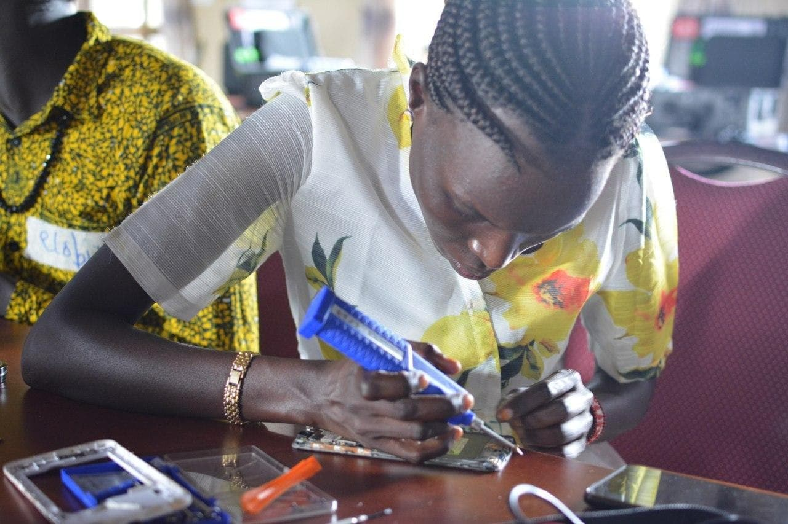

# Community Repair Café

A Community Repair Café is a youth led project with a vision of helping the community through repairs of electrics that might have gotten spoiled to reduce the expense of getting a new one.

### REPAIR IS BETTER THAN RECYCLING
Making our things last longer is both more efficient and more
cost-effective than mining them for raw materials.

### REPAIR SAVES YOU MONEY
Fixing things is often free, and usually cheaper than replacing
them. Doing the repair yourself saves you money.

### REPAIR TEACHES ENGINEERING
The best way to find put how something works is to take it apart.

### REPAIR SAVES THE PLANET
Earth has limited resources. Eventually we will run our.
The best way to be efficient is to reuse what we already have.

## How to's for a repair cafe

* [how to start](how-to-start.md)
* [how to setup](how-to-setup.md) Example: [Minimal Repair Setup](https://github.com/ASKnet-Open-Training/Minimal-Repair-Setup)
* [how to inform](how-to-inform.md)
* [how to run](how-to-run.md)
* [how to document](how-to-document.md)

## Other Repair Cafe Projects

https://wikifab.org/wiki/Group:ASKnet_Open_Tech

## Examples

* [Tools and Materials](Example-tools-and-materials.md)
* [Minimal Repair Setup](https://github.com/ASKnet-Open-Training/Minimal-Repair-Setup)

## FAQ's

* How to attract the Community to access the Repair Cafe?

## Partners and Founders

| r0g Agency | ASKnet | - |
| :--------: | :----: | :-------------------------: |
|||  |
| [Official Website](https://openculture.agency/) | [Official Website](https://github.com/ASKnet-Open-Training) | [Official Website](https://www.bmz.de/en/) |

## License

[MIT License](LICENSE)