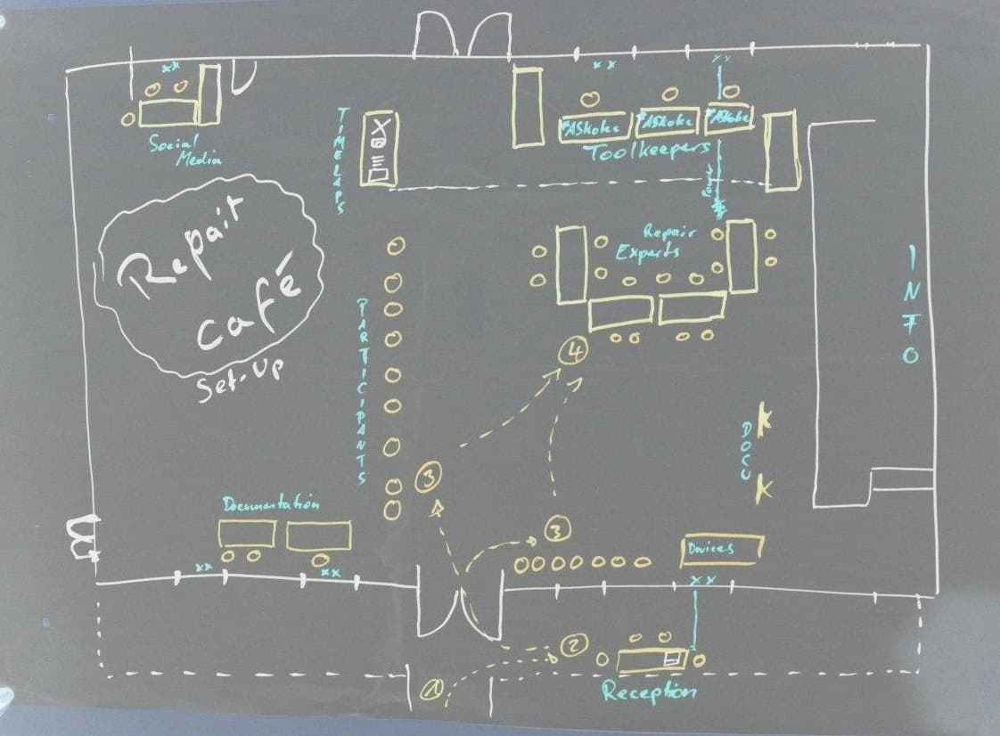
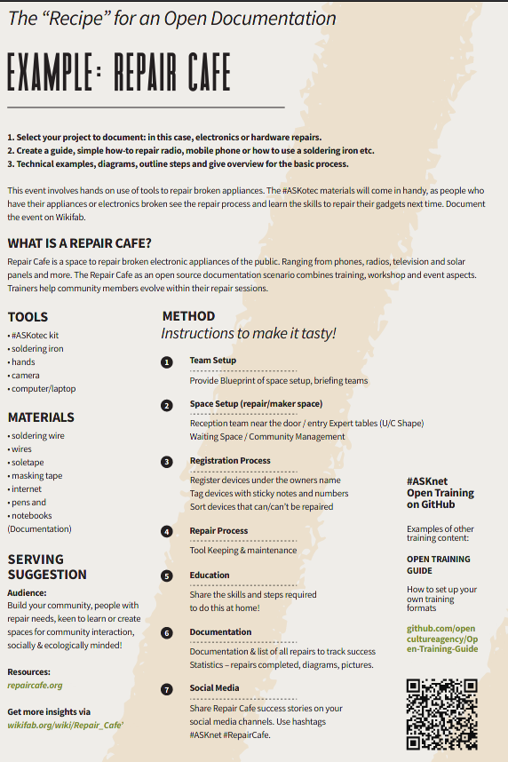

# How to run a repair cafe

1. At the reception we shall an expert to register the broken devices brought by the community,that's table one.

2. our experts will be specialised,one will hand solars and radios,the second will handle small electronics such as phones,lighting systems etc.
3. the third one will handle computer repair and maintainance(both mechanical and soft ware).
4. fixing of the devices will start after establishing the registered number of devices at the reception.
5. A support team in which one personnel will have a camera or a smart phone to take the coverage of the activities ie photos,video clips etc.
6. One person will be doing online documentations such the people away from the site will follow online proceedings and comment where necessary.
7. Before the everything resumes we shall have an expert who will introduce the set up to our online teams.
8. One of the expert to interview a community member about how the repair cafe has impacted him/her.
9. comments by teams involved, @ member to write about the activities
10. Closing remarks by the host.

